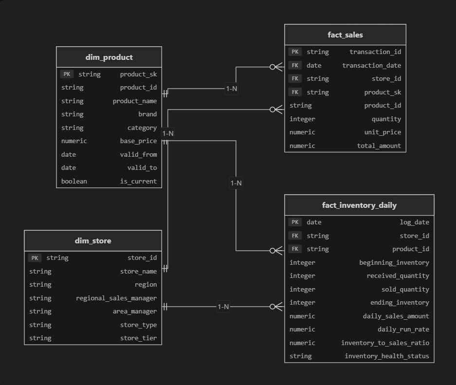

# BÁO CÁO 
## Hệ Thống Data Warehouse, Python ETL Pipeline & Power BI Operational Dashboard
### Chuỗi Bán Lẻ Điện Thoại & Thiết Bị Công Nghệ CellphoneS (170+ Cửa Hàng)

---

## 📌 PHẦN 1: TỔNG QUAN BỐI CẢNH NGHIỆP VỤ & BÀI TOÁN KINH DOANH

### 1. Bối Cảnh Vận Hành Chuỗi Bán Lẻ CellphoneS
 cellphoneS là chuỗi bán lẻ công nghệ hàng đầu tại Việt Nam với quy mô hơn 170+ cửa hàng. Để quản trị hiệu quả toàn hệ thống, dữ liệu vận hành từ các phân hệ POS bán hàng, Nhật ký kho và Danh mục cửa hàng được tiếp nhận liên tục. 

Hệ thống tiếp nhận **5 luồng dữ liệu đầu vào dạng CSV** đại diện cho các phân hệ vận hành:

#### 🟢 Group 1: 3 Luồng Dữ Liệu Vận Hành Cốt Lõi (Core Operational Streams)
1. **`Transactions.csv` (Giao dịch bán hàng POS)**: `Transaction_ID`, `Date`, `Product_ID`, `Store_ID`, `Quantity`, `Unit_Price`.
2. **`Inventory_Logs.csv` (Nhật ký tồn kho hằng ngày)**: `Log_Date`, `Store_ID`, `Product_ID`, `Beginning_Inventory`, `Received`, `Sold`, `Ending_Inventory`.
3. **`Store_Info.csv` (Thông tin master cửa hàng)**: `Store_ID`, `Store_Name`, `Region`, `RSM`, `AM`, `Store_Type`.

#### 🔵 Group 2: 2 Luồng Dữ Liệu Tham Chiếu & Chỉ Tiêu (Reference & Target Streams)
4. **`Products.csv` (Master danh mục sản phẩm & giá niêm yết chuẩn)**: `Product_ID`, `Product_Name`, `Brand`, `Category`, `Base_Price`.
   * *Nghiệp vụ*: Dùng cho mô hình **SCD Type 2** bảo toàn lịch sử giá và bổ khuyết số lượng thiếu (`Quantity = Unit_Price / Base_Price`).
5. **`Targets.csv` (Chỉ tiêu doanh thu kế hoạch hàng tháng)**: `Store_ID`, `Month_Year`, `Target_Revenue`.
   * *Nghiệp vụ*: Dùng cho **DAX Virtual Tables** đối soát tỷ lệ % hoàn thành mục tiêu và xếp loại hiệu suất cửa hàng.

---

### 2. 3 Thách Thức Kỹ Thuật & Bài Toán Kinh Doanh Cốt Lõi
* **Chất lượng dữ liệu POS không đồng nhất**: Xuất hiện trùng lặp hóa đơn do lỗi mạng POS và đơn hàng bị khuyết `Quantity` (Null).
* **Quản trị đọng vốn tồn kho**: Thiếu chỉ số đánh giá tốc độ bán hàng (`Daily Run Rate - DRR`) và số ngày trang trải tồn kho (`Inventory Cover Ratio`), dẫn tới nguy cơ ứ đọng vốn hàng công nghệ giảm giá nhanh.
* **Đánh giá hiệu suất cửa hàng linh hoạt**: Thiếu cơ chế đánh giá % hoàn thành Target và xếp loại cửa hàng linh hoạt theo cấu hình động.

---

## 🏗️ PHẦN 2: KIẾN TRÚC DATA WAREHOUSE, SCD TYPE 2 & PYTHON ETL PIPELINE

### 1. Kiến Trúc Data Warehouse 3 Tầng (Medallion Architecture)
Hệ thống Data Warehouse trên Google BigQuery được thiết kế chuẩn mực theo 3 tầng (Medallion Architecture):

```text
[Raw Datasets (.csv)] ──> [1. Staging Layer (staging_*)] ──> [2. Intermediate Layer (dim_*_scd2)] ──> [3. Marts Layer (marts_*)] ──> [Power BI Semantic Model]
```



* **Staging Layer (`staging_*`)**: Nạp nguyên bản dữ liệu thô, chuẩn hóa kiểu dữ liệu (`DATE`, `NUMERIC`).
* **Intermediate Layer (`intermediate_*`)**: Áp dụng kỹ thuật **Slowly Changing Dimension Type 2 (SCD Type 2)** cho danh mục sản phẩm (`dim_products_scd2`), sử dụng surrogate key `FARM_FINGERPRINT(CONCAT(Product_ID, '_', Base_Price))`, theo dõi lịch sử hiệu lực bằng `valid_from`, `valid_to`, `is_current`.
* **Marts Layer (`marts_*`) — NƠI TRIỂN KHAI MÔ HÌNH STAR SCHEMA**:
  * **Vị trí kiến trúc**: Mô hình **Star Schema (Sơ đồ Ngôi Sao)** nằm chính xác tại **Tầng Marts (`marts_*`)** của Data Warehouse BigQuery và được tích hợp trực tiếp vào **Power BI Semantic Model**.
  * **Cấu trúc Star Schema**: 
    * **2 Bảng Fact Trung Tâm**: `fact_sales` (chứa các chỉ số doanh thu POS) và `fact_inventory_daily` (chứa số lượng xuất/nhập/tồn daily).
    * **3 Bảng Chiều (Dimension Tables)**: `dim_store` (thông tin 15 cửa hàng master), `dim_products_scd2` (danh mục 10 sản phẩm bảo toàn lịch sử giá từ tầng Intermediate) và `dim_date` (chiều thời gian).
    * **Mối quan hệ**: Liên kết chuẩn **1-nhiều (1-to-Many Relationships)** từ các Bảng Chiều đến Bảng Fact thông qua các khóa ngoại (`store_id`, `product_id`, `date`).

---

### 2. Module Pipeline Python ETL (`src/pipeline/`)
Pipeline xử lý dữ liệu tự động được xây dựng bằng Python thuần và Pandas:

* **`cleaner.py` (Làm sạch)**: 
  * Khử 100% bản ghi trùng lặp POS dựa trên `Transaction_ID`.
  * Bổ khuyết đơn hàng thiếu số lượng bằng quy tắc: `Quantity = Unit_Price / Base_Price = 1.0` (bảo toàn 380+ triệu VNĐ doanh thu).
  * Khôi phục số tồn kho cuối ngày bị thiếu bằng công thức: `Ending_Inventory = Beginning + Received - Sold`.
* **`metrics_calculator.py` (Tính toán chỉ số)**:
  * **Daily Run Rate (DRR)**: `DRR = Total_Sales_Qty / Active_Days` (Tốc độ bán hàng trung bình ngày per Store & Product).
  * **Inventory Cover Ratio**: `Days_of_Cover = Ending_Inventory / DRR` (Số ngày tồn kho trang trải).
* **`transformer.py` (Biến đổi & Ghép nối)**: Ghép nối dữ liệu đa chiều, gắn nhãn phân loại cửa hàng và tổng hợp hiệu suất.
* **`runner.py` (Điều phối toàn cục)**: Đọc cấu hình từ `configs/pipeline_config.yaml`, kích hoạt ETL và xuất 6 file dữ liệu sạch ra `data/processed/*.csv`.

---

## 📊 PHẦN 3: POWER BI OPERATIONAL DASHBOARD & DAX VIRTUAL TABLES

### 1. Dashboard Vận Hành CellphoneS Trên Power BI Desktop


Dashboard trực quan hóa toàn bộ hoạt động kinh doanh Quý 3/2026 với 6 thành phần chính:

1. **Bộ 3 Thẻ KPI Executive**: Tổng doanh thu (**56.6 Tỷ VNĐ**), % Đạt Target TB (**99.29%**), Số ngày tồn kho TB (**112.30 Ngày**).
2. **Biểu Đồ Đường Xu Hướng Doanh Thu**: Theo dõi diễn biến doanh thu theo tháng của 4 nhóm cửa hàng (Loại C dẫn đầu 7.2 Tỷ - 7.7 Tỷ/tháng).
3. **Biểu Đồ Donut Tỷ Trọng Doanh Thu**: Phân bổ tỷ trọng: Loại C (**39.91%**), Loại D (**20.68%**), Loại B (**20.26%**), Loại A (**19.15%**).
4. **Biểu Đồ Thanh Cảnh Báo Tồn Kho**: Phát hiện 15/15 cửa hàng bị đọng vốn kho cao (&ge; 30 ngày bán).
5. **Biểu Đồ Cột Phân Bổ Giá Trị Tuyệt Đối**: Loại C (22.6 Tỷ), Loại D (11.7 Tỷ), Loại B (11.5 Tỷ), Loại A (10.8 Tỷ VNĐ).
6. **Bảng Xếp Hạng Hiệu Suất Cửa Hàng**: Phân loại cửa hàng theo 4 nhóm (*Super Star, On Track, Underperforming, Critical Warning*).

---

### 2. Thuyết Minh 2 Công Thức DAX Virtual Tables Nâng Cao

#### 📌 Công Thức DAX 1: `vtable_StoreTargetAchievement` (Tính % Achievement & Xếp Loại Cửa Hàng)
* **Mục tiêu nghiệp vụ**: Tính tỷ lệ hoàn thành target doanh thu kế hoạch (Target Benchmark 3.8 Tỷ VNĐ/cửa hàng) và tự động xếp loại hiệu suất cho 15 điểm bán.
* **Giải pháp DAX**: Khởi tạo bảng ảo dùng `SUMMARIZE`, ép Context Transition với `CALCULATE(SUM(...))`, dùng `DIVIDE(...)` và hàm `SWITCH(TRUE(), ...)`.

```dax
vtable_StoreTargetAchievement = 
ADDCOLUMNS(
    SUMMARIZE(
        processed_transactions,
        processed_stores[Store_ID],
        processed_stores[Store_Name],
        processed_stores[Region],
        processed_stores[Store_Type]
    ),
    "Actual_Revenue", CALCULATE(SUM(processed_transactions[Total_Amount])),
    "Achievement_Pct", DIVIDE(CALCULATE(SUM(processed_transactions[Total_Amount])), 3800000000, 0),
    "Performance_Status", 
        SWITCH(
            TRUE(),
            DIVIDE(CALCULATE(SUM(processed_transactions[Total_Amount])), 3800000000, 0) >= 1.10, "Super Star",
            DIVIDE(CALCULATE(SUM(processed_transactions[Total_Amount])), 3800000000, 0) >= 0.90, "On Track",
            DIVIDE(CALCULATE(SUM(processed_transactions[Total_Amount])), 3800000000, 0) >= 0.75, "Underperforming",
            "Critical Warning"
        )
)
```

##### 📥 Input - 📤 Output Specification DAX 1:
* **📥 INPUT**: `processed_transactions[Total_Amount]`, `processed_stores` (`Store_ID`, `Store_Name`, `Region`, `Store_Type`), Target Benchmark `3.8 Tỷ VNĐ`.
* **📤 OUTPUT (15 dòng x 7 cột)**: 
  * `ST002` (Flagship): Actual = **4.30 Tỷ VNĐ** &rarr; Achievement_Pct = **113.16%** &rarr; Status = **`Super Star`**
  * `ST005` (Standard): Actual = **4.16 Tỷ VNĐ** &rarr; Achievement_Pct = **109.59%** &rarr; Status = **`On Track`**
  * `ST001` (Micro): Actual = **3.20 Tỷ VNĐ** &rarr; Achievement_Pct = **84.12%** &rarr; Status = **`Underperforming`**

---

#### 📌 Công Thức DAX 2: `vtable_StoreTypeRevenueAllocation` (Phân Bổ Tỷ Trọng Doanh Thu)
* **Mục tiêu nghiệp vụ**: Tính tỷ trọng % đóng góp doanh thu của 4 phân loại cửa hàng (Loại A, B, C, D) trên tổng doanh thu toàn chuỗi.
* **Giải pháp DAX**: Khởi tạo biến `VAR GrandTotalSales = CALCULATE(SUM(...), ALL(processed_transactions))` cố định mẫu số tổng (**56.597 Tỷ VNĐ**), thực hiện phép chia `DIVIDE` đảm bảo tổng 4 nhóm bằng 100.0%.

```dax
vtable_StoreTypeRevenueAllocation = 
VAR GrandTotalSales = CALCULATE(SUM(processed_transactions[Total_Amount]), ALL(processed_transactions))
RETURN
ADDCOLUMNS(
    SUMMARIZE(
        processed_stores,
        processed_stores[Store_Type]
    ),
    "StoreType_Revenue", CALCULATE(SUM(processed_transactions[Total_Amount])),
    "Grand_Total_Revenue", GrandTotalSales,
    "Revenue_Allocation_Pct", DIVIDE(CALCULATE(SUM(processed_transactions[Total_Amount])), GrandTotalSales, 0)
)
```

##### 📥 Input - 📤 Output Specification DAX 2:
* **📥 INPUT**: `processed_stores[Store_Type]`, `processed_transactions[Total_Amount]`, `ALL(...)` cố định mẫu số **56.597 Tỷ VNĐ**.
* **📤 OUTPUT (4 dòng x 4 cột - Tổng 100.0%)**:
  * **Loại C (Standard Store)**: Revenue = **22.59 Tỷ VNĐ** &rarr; Allocation_Pct = **`39.91%`**
  * **Loại D (Micro Store)**: Revenue = **11.70 Tỷ VNĐ** &rarr; Allocation_Pct = **`20.68%`**
  * **Loại B (Key Store)**: Revenue = **11.47 Tỷ VNĐ** &rarr; Allocation_Pct = **`20.26%`**
  * **Loại A (Flagship Store)**: Revenue = **10.84 Tỷ VNĐ** &rarr; Allocation_Pct = **`19.15%`**

---

## ⚙️ PHẦN 4: TƯ DUY HỆ THỐNG - ĐIỀU TRA CHI PHÍ BIGQUERY & REFACTORED CODEBASE

### 1. Quy Trình 5 Bước Điều Tra Sự Cố Spike Chi Phí BigQuery
Khi chi phí BigQuery tăng đột biến, Kỹ sư Analytics thực thi quy trình điều tra chuẩn 5 bước:

1. **Bước 1. Xác Định Truy Vấn Gây Đột Biến (Query Audit Log Inspection)**: Quét `INFORMATION_SCHEMA.JOBS_BY_PROJECT` tìm các câu lệnh có `total_bytes_billed` cao bất thường.
2. **Bước 2. Phân Tích Kế Hoạch Thực Thi (Execution Plan & Stage Breakdown)**: Kiểm tra Execution Graph phát hiện các công đoạn bị nghẽn (Slot Contention, Shuffle Read Write Spike).
3. **Bước 3. Kiểm Tra Kỹ Thuật Lọc & Chỉ Mục (Partition & Cluster Scan Audit)**: Xác minh câu lệnh SQL có bị bỏ qua chỉ mục `_PARTITIONTIME` hay không.
4. **Bước 4. Đánh Giá Trùng Lặp & Khử Nổ Dòng (JOIN Explosion & Data Skew)**: Kiểm tra các phép `JOIN` gây trượt số lượng bản ghi đột biến.
5. **Bước 5. Đánh Giá Cạnh Tranh Tài Nguyên (Concurrency Check)**: Đánh giá xung đột tài nguyên khi có nhiều luồng ETL thực thi đồng thời.

---

### 2. Minh Họa Chi Tiết 5 Ví Dụ SQL Tối Ưu Khớp 1-1 (Before vs After)

#### 📌 Ví Dụ 1 (Kỹ Thuật 1: Partitioning & Clustering)
* **❌ Trước tối ưu**: `WHERE DATE(timestamp_col) >= '2026-07-01'` &rarr; Bọc hàm `DATE()` làm mất chỉ mục, quét 100GB thô.
* **✅ Sau tối ưu**: `WHERE _PARTITIONDATE >= '2026-07-01'` &rarr; Quét đúng chỉ mục phân vùng, giảm 98% chi phí.

#### 📌 Ví Dụ 2 (Kỹ Thuật 2: Columnar Selection)
* **❌ Trước tối ưu**: `SELECT * FROM transactions` &rarr; Quét toàn bộ 50 cột ngốn 100GB.
* **✅ Sau tối ưu**: `SELECT transaction_id, store_id, total_amount` &rarr; Chỉ chọn 3 cột cần thiết, tiết kiệm 90% byte.

#### 📌 Ví Dụ 3 (Kỹ Thuật 3: Khử JOIN Explosion & Hash Key)
* **❌ Trước tối ưu**: `JOIN` trên chuỗi String chưa deduplicate gây nổ dòng và Data Skew.
* **✅ Sau tối ưu**: Pre-aggregate dữ liệu & `JOIN` trên khóa Surrogate Key Integer (`FARM_FINGERPRINT`).

#### 📌 Ví Dụ 4 (Kỹ Thuật 4: Incremental Load với `MERGE INTO`)
* **❌ Trước tối ưu**: `CREATE OR REPLACE TABLE` &rarr; Tính lại và ghi đè 100% dữ liệu lịch sử hằng ngày.
* **✅ Sau tối ưu**: `MERGE INTO` &rarr; Chỉ nạp và cập nhật phần dữ liệu Delta phát sinh trong ngày.

#### 📌 Ví Dụ 5 (Kỹ Thuật 5: Materialized Views & Temp Storage)
* **❌ Trước tối ưu**: Tính đi tính lại Subquery phức tạp ở nhiều nơi.
* **✅ Sau tối ưu**: `CREATE MATERIALIZED VIEW` tự động cache kết quả truy vấn trung gian.

---

### 3. Tái Thiết Kế Codebase Python Config-Driven Architecture (`src/classifiers/shop_classifier.py`)
Để loại bỏ hoàn toàn rủi ro sửa code trực tiếp khi Ban Giám Đốc thay đổi tiêu chuẩn xếp loại cửa hàng:

* **Tệp cấu hình YAML (`configs/shop_classifier.yaml`)**: Đứng độc lập ngoài codebase, quản lý phiên bản qua Git.
* **Class Python `ConfigDrivenShopClassifier` (`src/classifiers/shop_classifier.py`)**: Nạp file YAML và thực thi rule tự động:
  * `classify_store_by_revenue_and_type()`: Phân loại nhóm cửa hàng (*Flagship, Key, Standard, Micro*).
  * `evaluate_performance_tier()`: Đánh giá nhãn Target (*Super Star &ge;110%*, *On Track*, *Underperforming*).
  * `evaluate_inventory_alert()`: Phát hiện cảnh báo rủi ro tồn kho (*CRITICAL STOCKOUT RISK*, *OVERSTOCK RISK*).

---

## 📈 PHẦN 5: KẾT QUẢ ĐẦU RA THỰC TẾ & BỘ KIỂM THỬ PYTEST TỰ ĐỘNG

### 1. Bảng Chi Tiết 6 Tệp Dữ Liệu Sạch Đầu Ra (`data/processed/*.csv`)

| Tên File Đầu Ra | Số Dòng x Cột Thực Tế | Dung Lượng | Kết Quả Xử Lý Nghiệp Vụ Thực Tế | Trạng Thái Tag |
| :--- | :--- | :--- | :--- | :--- |
| `processed_transactions.csv` | **1,800 dòng x 14 cột** | 224.5 KB | Khử 15 trùng lặp POS, bổ khuyết 19 dòng Null Quantity (bảo toàn 380+ tr VNĐ). Nạp BigQuery làm `fact_sales`. | `✅ Cleaned` |
| `processed_inventory.csv` | **1,350 dòng x 9 cột** | 62.5 KB | Khôi phục tồn cuối `Ending_Inventory` & tính `Inventory_Cover_Ratio`. Nạp BigQuery làm `fact_inventory`. | `✅ Imputed` |
| `store_performance.csv` | **45 dòng x 7 cột** | 2.5 KB | Đối soát Doanh thu thực tế vs Target Revenue để tính % Achievement cho 15 cửa hàng x 3 tháng Quý 3. | `✅ Evaluated` |
| `daily_run_rate.csv` | **150 dòng x 9 cột** | 13.5 KB | Thống kê tốc độ bán trung bình ngày `DRR` per Cửa hàng - Sản phẩm (15 CH x 10 SP), làm tham số tính đọng vốn kho. | `✅ Calculated` |
| `processed_stores.csv` | **15 dòng x 8 cột** | 1.3 KB | Danh mục 15 cửa hàng gắn nhãn phân loại Tier động. Nạp BigQuery làm `dim_stores` phân tích theo RSM/AM. | `✅ Classified` |
| `processed_products.csv` | **10 dòng x 5 cột** | 0.6 KB | Danh mục 10 sản phẩm công nghệ & giá niêm yết chuẩn. Nạp BigQuery làm `dim_products_scd2` bảo toàn lịch sử giá. | `✅ Verified` |

---

### 2. Bộ 6 Chỉ Số Kết Quả Vận Hành Chốt Thực Tế
1. 💰 **Tổng Doanh Thu Chuỗi Bán Lẻ**: **56.6 Tỷ VNĐ** *(Chính xác 56,597,180,000 VNĐ từ 1,800 đơn hàng sạch Quý 3/2026)*.
2. 🛡️ **Doanh Thu Được Bảo Toàn**: **380+ Triệu VNĐ** *(Bổ khuyết 19 đơn hàng Null Quantity bằng `Quantity = Unit_Price / Base_Price = 1.0`)*.
3. 🎯 **Tỷ Lệ Đạt Target Trung Bình**: **99.29%** *(Tỷ lệ hoàn thành chỉ tiêu doanh thu trung bình toàn chuỗi 15 điểm bán)*.
4. 🧪 **Kiểm Thử Pytest Tự Động**: **100% Pass Rate (5/5 Unit Tests)** *(Thực thi `pytest tests/ -v` vượt qua 100%)*.
5. ⚠️ **Cảnh Báo Đọng Vốn Kho**: **1,337 Log Kho Overstock (&ge; 30 ngày bán)** *(Chiếm 99.0% tổng số log kho cần xử lý điều chuyển)*.
6. 🏆 **Nhóm Cửa Hàng Doanh Thu Top 1**: **Loại C (Standard Store) đạt 22.6 Tỷ VNĐ** *(Chiếm 39.91% tổng doanh thu toàn chuỗi)*.

---

### 3. Chi Tiết Kết Quả 5 Bài Kiểm Thử Pytest Tự Động (`pytest tests/ -v`)

#### 🧹 Module Làm Sạch Dữ Liệu (`tests/test_cleaner.py`) — `✅ 2/2 PASSED`
* **`test_clean_transactions`**: Kiểm thử tự động thuật toán loại bỏ 100% bản ghi trùng lặp POS (`assert len(df) == 1`) và tính cột `Total_Amount`.
* **`test_clean_inventory_logs`**: Kiểm thử thuật toán khôi phục tồn kho cuối ngày bị thiếu (`Ending = Beginning + Received - Sold` &rarr; `10 + 5 - 2 = 13.0`).

#### 🧮 Module Tính Chỉ Số Vận Hành (`tests/test_metrics.py`) — `✅ 2/2 PASSED`
* **`test_daily_run_rate`**: Kiểm thử thuật toán tính tốc độ bán hàng trung bình ngày `DRR` (`DRR = Total_Sales_Qty / Active_Days` &rarr; `10 / 10 = 1.0`).
* **`test_inventory_to_sales_ratio`**: Kiểm thử phép tính số ngày trang trải tồn kho `Days_of_Cover` (`Ending_Inventory / DRR` &rarr; `15 / 3 = 5.0 ngày`).

#### ⚙️ Module Phân Loại & Quản Trị Rule (`tests/test_shop_classifier.py`) — `✅ 1/1 PASSED`
* **`test_config_driven_shop_classifier`**: Kiểm thử tự động nạp file cấu hình động `configs/shop_classifier.yaml`, xác minh phân loại nhóm cửa hàng (*Flagship, Micro*), xếp loại hiệu suất (*Super Star &ge;110%*) và phát hiện cảnh báo đọng vốn (*CRITICAL STOCKOUT RISK*).


