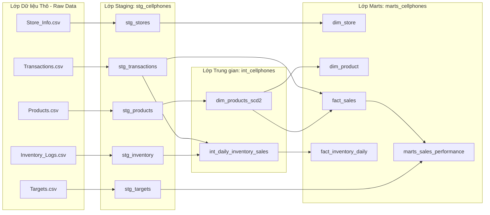

# Kiến trúc Kho Dữ liệu, Sơ đồ ERD & Chiến lược SCD Type 2
## Phần 1 Đề bài Đánh giá: Mô hình hóa Kho Dữ liệu Doanh nghiệp CellphoneS (170+ Cửa hàng)

---

## 1. Kiến trúc Hệ thống Tổng quan & Luồng Dữ liệu (Data Flow)

Dữ liệu thô từ 170+ cửa hàng CellphoneS được xử lý qua 3 tầng chuẩn hóa (Kiến trúc 3 lớp Medallion: Staging - Intermediate - Marts):



---

## 2. Sơ đồ Mối quan hệ Thực thể (ERD) - Mô hình Star Schema

```mermaid
erDiagram
    dim_store ||--o{ fact_sales : "170+ cửa hàng phát sinh doanh số"
    dim_store ||--o{ fact_inventory_daily : "cửa hàng lưu kho sản phẩm"
    dim_product ||--o{ fact_sales : "sản phẩm được bán"
    dim_product ||--o{ fact_inventory_daily : "sản phẩm theo dõi tồn kho"

    dim_store {
        string store_id PK
        string store_name
        string region
        string regional_sales_manager
        string area_manager
        string store_type
        string store_tier
    }

    dim_product {
        string product_sk PK
        string product_id NK
        string product_name
        string brand
        string category
        numeric base_price
        date valid_from
        date valid_to
        boolean is_current
    }

    fact_sales {
        string transaction_id PK
        date transaction_date FK
        string store_id FK
        string product_id
        string product_sk FK
        integer quantity
        numeric unit_price
        numeric total_amount
    }

    fact_inventory_daily {
        date log_date PK
        string store_id FK
        string product_id FK
        integer beginning_inventory
        integer received_quantity
        integer sold_quantity
        integer ending_inventory
        numeric daily_sales_amount
        numeric daily_run_rate
        numeric inventory_to_sales_ratio
        string inventory_health_status
    }
```

---

## 3. Chiến lược Kiến trúc SCD Type 2 (Quản lý Biến động Giá & Thuộc tính Sản phẩm)

### 3.1 Bối cảnh Nghiệp vụ (Business Context)
Tại chuỗi 170+ cửa hàng CellphoneS, giá niêm yết (`base_price`) và thông tin sản phẩm (ví dụ: iPhone 15 Pro Max, Samsung Galaxy S24 Ultra) thường xuyên thay đổi theo thời gian hoặc các chương trình khuyến mãi.
- **Nếu dùng SCD Type 1 (Ghi đè trực tiếp)**: Doanh thu lịch sử trong quá khứ sẽ bị tính sai theo giá mới, làm sai lệch báo cáo tài chính.
- **Giải pháp SCD Type 2**: Tạo bản ghi phiên bản mới kèm khoảng thời gian hiệu lực (`valid_from`, `valid_to`) và trạng thái `is_current`.

### 3.2 Cấu trúc Bản ghi SCD Type 2
- `product_sk`: Surrogate Key duy nhất cho từng phiên bản, được sinh bằng `FARM_FINGERPRINT(CONCAT(product_id, '_', valid_from))`.
- `product_id`: Natural Key/Business Key từ hệ thống nguồn.
- `valid_from`: Ngày bắt đầu hiệu lực giá mới.
- `valid_to`: Ngày kết thúc hiệu lực giá cũ (mặc định `9999-12-31` cho phiên bản hiện tại).
- `is_current`: `TRUE` cho bản ghi đang dùng, `FALSE` cho bản ghi lịch sử.

### 3.3 Quy trình Cập nhật MERGE Pattern trên Google BigQuery
1. Sử dụng lệnh `MERGE` so sánh `product_id` giữa `stg_products` và `dim_products_scd2` đang có `is_current = TRUE`.
2. Khi phát hiện giá `base_price` hoặc thuộc tính thay đổi, thực hiện `UPDATE` đóng bản ghi cũ:
   `SET valid_to = CURRENT_DATE - 1, is_current = FALSE`.
3. Thực hiện `INSERT` bản ghi phiên bản mới với `valid_from = CURRENT_DATE`, `valid_to = '9999-12-31'`, `is_current = TRUE`.
